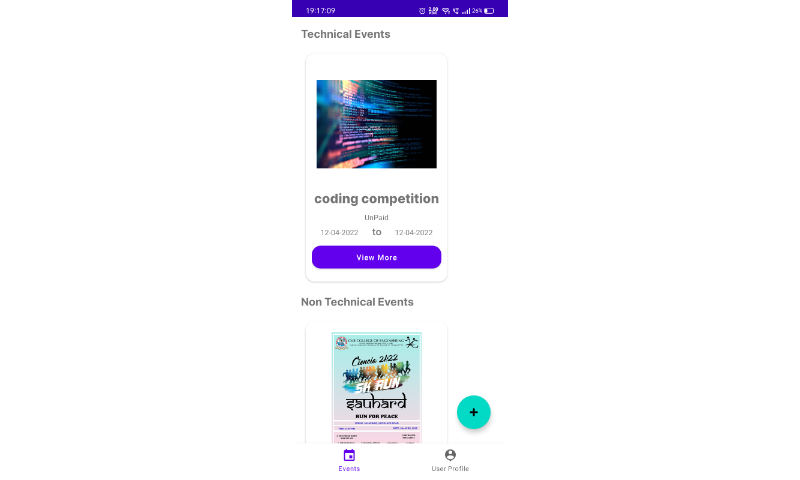
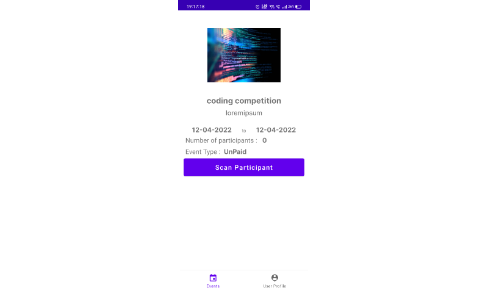
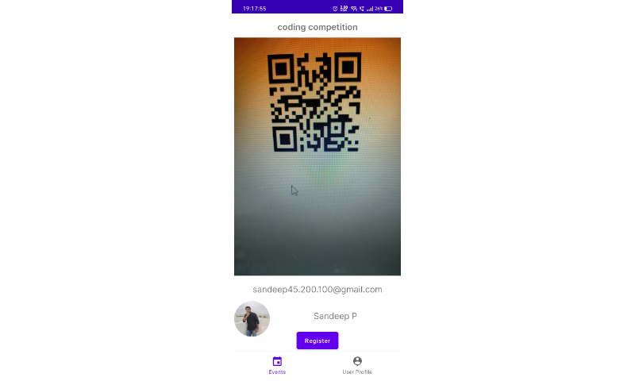
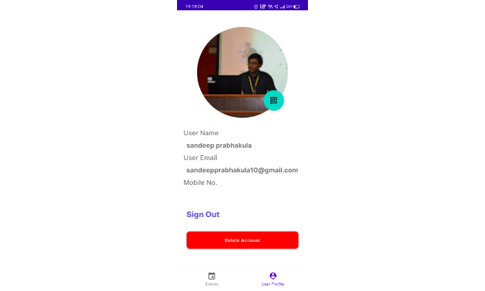
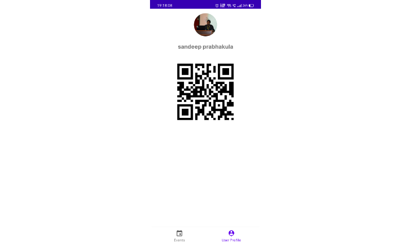

# Event-Management-App
You can manage your college events here without any financial scams.

App is very useful for conducting the huge events which contains sub events.
This app contains QR code Scanner for keep track on the participants participating in an event.
User can also access the events data offline and also required less bandwidth consumption and low power.

||||

• Kotlin

• Jetpack Navigation

• Firebase Firestore

• Firebase Authentication

• Firebase Cloud Messaging for push notification

• QR Code generator - zxing

• QR Code Scanner - play services vision
